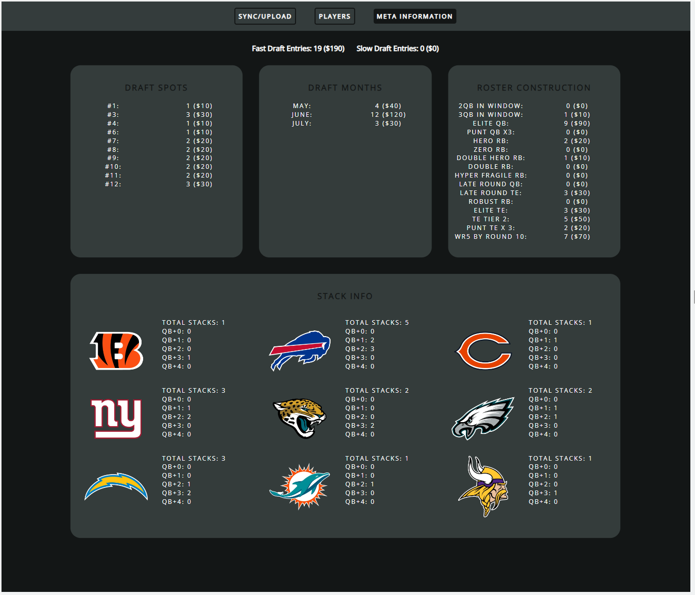

# DK-NFL-BestBall-PortfolioBuilder

A scraper tool used to build your NFL BestBall portfolio on DraftKings.

## Installation & Usage

1. To begin installation, you must ensure that "Developer mode" is enabled in your chrome extensions. To do this, navigate to `chrome://extensions/` in your browser, and click the toggle icon in the top right. You will also need a .zip file extractor, such as WinRAR or 7zip.

2. Download this repository as a .zip file. At the top of this page, there is a green button that says "Code". Click it, and select "Download ZIP" from the dropdown menu.

3. Open the downloaded .zip file, click into the folder that says `DK-NFL-BestBall-PortfolioBuilder-main`, then again into the `zip` folder. Select the .zip file and extract it somewhere on your computer.

4. Navigate back to `chrome://extensions/` in your browser. In your operating system's file explorer, select that .zip file you just extracted, then drag & drop it onto the chrome extension page. You should now see the extension on that page.

5. To use the extension, click the puzzle-piece looking icon in the top right of Google Chrome, and "pin" the extension. Once you see it in the list of extension icons, click the icon and follow the instructions on-screen.

## Screenshots

